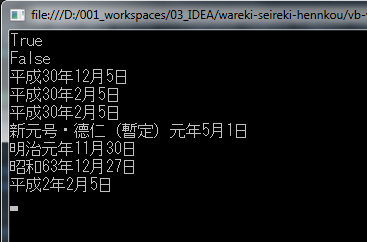

*阅读本文的其他语言版本：[日本語](README.md)、[English](README-en.md)。*


# 日本【和历】和【西历】相互转换


- [x] Java 版本：[java-version](/java-version/src/main/java/jp/sekito/conversion)   
- [x] VB   版本：[vb-version](/vb-version/conversion)   
- [x] C#   版本：[csharp-version](/csharp-version/conversion)


## 概要

日本天皇于2019年4月30日即将退位，其皇子将于5月1日继位，30年零4个月的【平成】元号即将落幕。
对于元号更替，【和历】和【西历】相互转换通常是比较麻烦的。本repository提供了为日本【和历】
和【西历】相互转换的方法（包括新元号・德仁（暂定）的转换）。


## 功能介绍

``` lua
wareki-seireki-hennkou
    +
    |
    +--java-version
    |      |
    |      +--jp.sekito.conversion
    |             |
    |             +--Seireki2WarekiConversion.java（西暦から和暦に変更するクラス）
    |             |      |
    |             |      + -- 日付形式(西暦)が正しいかどうかを判断する  checkDate()
    |             |      + -- 期日を変えることができるかどうかを判断する  isDate()
    |             |      + -- 西暦から和暦に変更する  warekiConversionApater()
    |             |
    |             +--Wareki2SeirekiConversion.java（和暦から西暦に変更するクラス）
    |                    |
    |                    + -- 日付形式(和暦)が正しいかどうかを判断する  checkDate()
    |                    + -- 和暦から西暦に変更する  seirekiConversionApater()
    |                    + -- 和暦変換(元年)  WarekigannenConversionMain()
    |                    + -- 期日を変えることができるかどうかを判断する  isDate()
    |                    + -- どの和暦か数値で取得する  warekiCheck()
    |                    + -- 和暦存在チェック warekiExistenceCheck()
    |                    + -- 和暦存在チェック（元年）warekiGannenExistenceCheck()
    |
    +--csharp-version
    |
    +--vb-version
```


## 转换方法

年号的划分区间：   
明治：1868年01月01日 ～ 1912年07月29日   
大正：1912年07月30日 ～ 1926年12月24日   
昭和：1926年12月25日 ～ 1989年01月07日   
平成：1989年01月08日 ～ 2019年04月30日   
德仁：1989年05月01日 ～


### 【西历】向【和历】转换方法

【向和历转换方法】
*（西暦 → 新元号・德仁（暫定）） "德仁" = "西暦" – 2019   
*（西暦 → 平成） "平成" = "西暦" – 1988   
*（西暦 → 昭和） "昭和" = "西暦" – 1925   
*（西暦 → 大正） "大正" = "西暦" – 1911   
*（西暦 → 明治） "明治" = "西暦" – 1867   


### 【和历】向【西历】转换方法

【向西历转换方法】   
*（德仁 → 西暦） "西暦" = "德仁" + 2019   
*（平成 → 西暦） "西暦" = "平成" + 1988   
*（昭和 → 西暦） "西暦" = "昭和" + 1925   
*（大正 → 西暦） "西暦" = "大正" + 1911   
*（明治 → 西暦） "西暦" = "明治" + 1867   


### 【西历】和【和历】转换格式

西历向和历转换   

输入：yyyy/MM/dd、yyyy/M/d   
输出：〇〇年MM年dd月、〇〇年M月d


和历向西历转换   

输入：〇〇年MM年dd月、〇〇年M月d   
输出：yyyy/MM/dd、yyyy/M/d


### VB版本输出图



## 授权许可

Licensed under the [MIT](LICENSE) License.


## 作者

bluetata / <sekito.lv@gmail.com>
