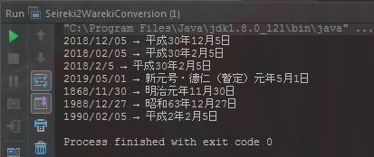

*Read this in other languages: [中文](README-cn.md), [日本語](README.md).*


# Conversion between the Japanese Calendar and the Western Calendar

- [x] JAVA&nbsp;version: [java-version](/java-version/src/main/java/jp/sekito/conversion)   
- [x] VB&nbsp;&nbsp;&nbsp;&nbsp;&nbsp;version: [vb-version](/vb-version/conversion)   
- [x] C#&nbsp;&nbsp;&nbsp;&nbsp;&nbsp;version: [csharp-version](/csharp-version/conversion)


## Intro

２０１９年４月３０日には天皇が退位され、翌５月１日に皇太子さまが即位、新元号が
適用される。３０年４カ月で幕を閉じることになる平成という。   
これに対し、和暦(元号)を西暦に換算するときの計算が面倒。このリポジトリは和暦(全元号)と
西暦の双方向変換をサポートする簡単な方法（新元号・令和[れいわ]を含む）。


## Function

``` lua
wareki-seireki-hennkou
    +
    |
    +--java-version
    |      |
    |      +--jp.sekito.conversion
    |             |
    |             +--Seireki2WarekiConversion.java（西暦から和暦に変更するクラス）
    |             |      |
    |             |      + -- 日付形式(西暦)が正しいかどうかを判断する  checkDate()
    |             |      + -- 期日を変えることができるかどうかを判断する  isDate()
    |             |      + -- 西暦から和暦に変更する  warekiConversionApater()
    |             |
    |             +--Wareki2SeirekiConversion.java（和暦から西暦に変更するクラス）
    |                    |
    |                    + -- 日付形式(和暦)が正しいかどうかを判断する  checkDate()
    |                    + -- 和暦から西暦に変更する  seirekiConversionApater()
    |                    + -- 和暦変換(元年)  WarekigannenConversionMain()
    |                    + -- 期日を変えることができるかどうかを判断する  isDate()
    |                    + -- どの和暦か数値で取得する  warekiCheck()
    |                    + -- 和暦存在チェック warekiExistenceCheck()
    |                    + -- 和暦存在チェック（元年）warekiGannenExistenceCheck()
    |
    +--csharp-version
    |
    +--vb-version
```


## Converting method

Japanese era name interval：   
明治: 1868年01月01日 ～ 1912年07月29日   
大正: 1912年07月30日 ～ 1926年12月24日   
昭和: 1926年12月25日 ～ 1989年01月07日   
平成: 1989年01月08日 ～ 2019年04月30日   
令和: 1989年05月01日 ～


### Conversion of the Western Calendar to the Japanese Calendar

【和暦への変換式】   
*（西暦 → 令和） "令和" = "西暦" – 2018   
*（西暦 → 平成） "平成" = "西暦" – 1988   
*（西暦 → 昭和） "昭和" = "西暦" – 1925   
*（西暦 → 大正） "大正" = "西暦" – 1911   
*（西暦 → 明治） "明治" = "西暦" – 1867   


### Conversion of the Japanese Calendar to the Western Calendar

【西暦への変換式】   
*（令和 → 西暦） "西暦" = "令和" + 2018   
*（平成 → 西暦） "西暦" = "平成" + 1988   
*（昭和 → 西暦） "西暦" = "昭和" + 1925   
*（大正 → 西暦） "西暦" = "大正" + 1911   
*（明治 → 西暦） "西暦" = "明治" + 1867   


### Format of the Japanese Calendar and the Western Calendar

Seireki to Wareki   

Input ：yyyy/MM/dd、yyyy/M/d   
Output：〇〇年MM年dd月、〇〇年M月d




Wareki to Seireki   

Input ：〇〇年MM年dd月、〇〇年M月d   
Output：yyyy/MM/dd、yyyy/M/d


### Output image of VB version


## License

Licensed under the [MIT](LICENSE) License.


## Author

bluetata / <sekito.lv@gmail.com>
